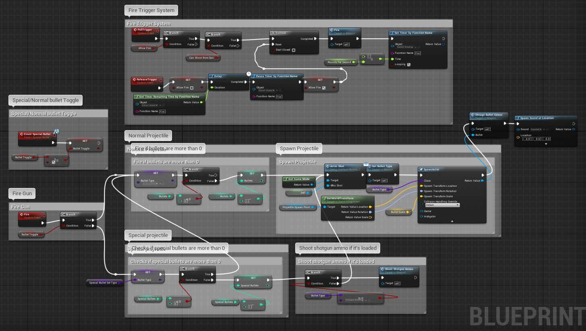

## About
Sapphire bullets is a local 4 player versus game. The main mechanic of the game revolves around players collecting special ammunition and firing it upon your enemies. Built on top of this there are also pickups that inchance the player for the match permanently. All of this taking place in a Futuristic Blade Runner like cyberpunk world. The game is a fun and exciting multiplayer experience.
The game has 7 different levels to play on.

When playing the game you must kill all other players in order to continue to the next level

#### Unique selling points
* A varied mix of different bullet types and player inhancers to pickup throughtout the levels
* A special catch mechanic that allows player to cath bullets as they are about to hit you
* Short and fast paced gameplay, allowing for bite sized fun gameplay

### Controls
The game is meant to be played with controllers to allow up to 4 player to play.
Control scheme layout for the controls on a xbox controller.

##### Controls for player 1 on keyboard:  
* WASD - for movement  
* Arrow keys - for aiming  
* Spacebar - for shooting  
* C - for cathing  
* V -  for punching  

* ALT + F4 to close the game

### Images
images and videos of the game

Promotional video of an older version of game  
  

video explanation of the game  

### The team
We are Coffee break studios!
We are a team of highly motivated students ready to create new and intresting games.

### Jose
Hi im Jose, my role in the team is lead designer. During initial stages i worked as a systems designer and made the GDD for the game. As development went on I started to focus on building levels and adjusting the game feel. Near the end i was working as a programer, making the pickups and prototyping small idea to enhance gameplay, and i also worked to adjust the little things in the game, putting assets in, working on the lighting, adding audio, etc…  This project has been great fun and a real learning experience both in learning how to design and how to work within a team environment.

### Tam
Yo, I’m Tam One of the artists for the team. Prior to this game my major specialism has been concept art but I’ve used this project as an opportunity to improve in other areas of artistic game development. Over the course of development I stepped into some form of leadership role for the art portion of the team. I was heavily involved in the initial creation of the world and art style, shaping much of the general aesthetic of the game. After the concepting phase of development my character design was the one that became the player characters and it was my responsibility to work with our animator to bring him to life. I also created some of the level assets and the UI art. This game has taught me a lot: how to use a new game engine, seeing a character through from concept to final model and texture and how to work in a team though both the highs and lows. So I want to say a big thanks to my team mates it’s been an honour.

### Barnaby
Hay, I’m one of the artists working on this project, I helped with concepting the prop modelling. My specialism is illustration but with this project I’ve tried to get better with concepting characters and environments as well prop design. It took me some time to get the hang of what I was doing but over all I’ve enjoyed the experience and I’ve learned a lot during this project.

### Stan
Hey im Stan, one of the BSc programmers and i was responsible for coding all the little parts of the game. I coded the ability to dash and the first ammo pick up, which was the foundation for the other pick ups in the game, as well as the melee attack. I also experimented with aiming lasers and knock back abilitys on the dashes and melee.  coding the dash was very simple to make, i just used the the launch character function to propel the character in the direction theyre facing, i also created a dash variable so you can alter the amount of distance covered. The ammo pick up was also simple to make, i just made a new pawn actor with a collision detector that would give the weapon more ammo once the player runs over it.

### Sam
Hey I'm Sam, I'm one of the programmers on the team, I started off this project by making the early prototype of the game from what the team had designed together.  
I carried on development as the lead gameplay programmer and worked on most parts of the game while iterating on all the different gameplay aspects that the designer would come up with.  

[Link to my Research Poster](ResearchPoster.jpg) exlpaining the player class system  

Some Blueprint snippets that I was responsible for creating:

#### The main menu, buttons and UI
  
Simple UI in UE4 was simple and quite fun to make.

#### The gamemode blueprint that changes the map when one last player is alive
  
This blueprint was very impoirtant to make to create the gameplay loop and have the game change map once a game has ended, without it you had to restart the game all over again just to change map.

#### The Player class

The Player class was probably the most complex part of the game, as it handled most of the game mechanics that allowed the players to play around. Took a lot of playtesting to get certain elements right.
Thinking back about it, I should of turned more of these blueprints into actual functions to be resused, it would of helped to make the player class easier to look at and faster to go thourgh when going back to it.  

#### The weapon class
  
The weapon class was sometimes quite difficult to implament alongisde the player class, but overall I think I managed to create some good solutions.

#### The bullet class
  
For the bullet classes I created a base bullet class that had the base functionatlies that all types of bullets had, and I made every other bullet type be a child of the base bullet, good case of inheritence being used. We also did this for pickups.
  
Overall I have really enjoyed this project, despite not being really that knowedgeable in using Unreal, but over the course of the project I have learnt a lot, about working effectively with a team and using blueprints in Unreal.  

### Eric
Hi, I'm Eric. I'm the 3D animator for this game project. I am responsible for everything the player character does right and wrong in terms of movement so if someone moves weirdly don't hesitate to blame that on me. I stared development by assisting the 3D character artist in creating a player character that would function well in the game. I then moved on to rigging and skin weighting the character so I could start animating for the game, which leads us to the finished game where I made all animations.  

##### Scott
Who am I?
I am a newbie programmer studying Computer Science for game
development at Falmouth university.
I am very interested in 'gamification' and the application of
computer science in education and e-health. I am also
very intrigued by the social/ psychological effects computer
science and games have on individuals and societies.
For my first group game project I was involved in construction and
programming of the games UI and main menu. Programming these
aspects
only required a limited knowledge of both unreal and programming
and was an excellent way for me to be introduced to
the game's engine.
Although my contribution to the overall game is not extensive, it
has lead me to better understand programming and the use of
Unreal. 
